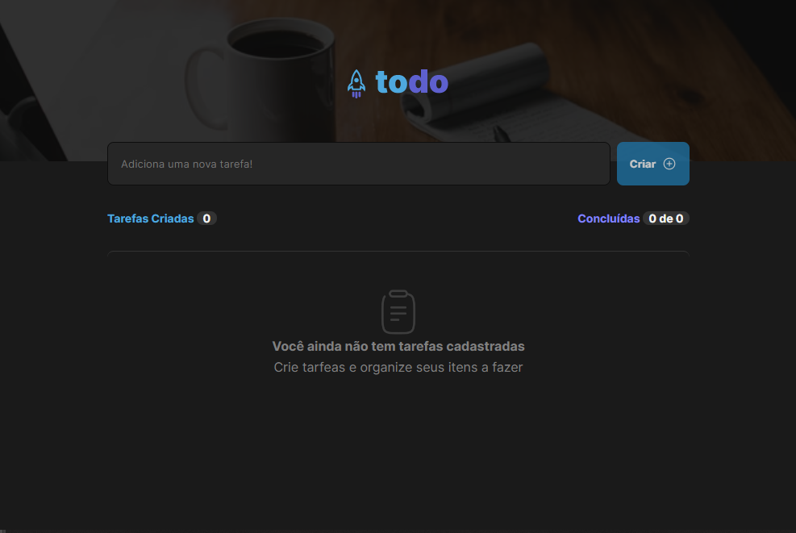

# Projeto Todo List - Ignite Rockeseat - 1 Desafio

  

- Projeto simples de uma lista de tarefas 

## Tecnologias
- React (Vite)
- Typescripts
- Phosphor React
- Material UI (Checkbox)

## O que aprendi ?

- Aprendi a utilizar os estados, sobre comunicação entre componentes, conceito de imutabilidade, CSS module.
